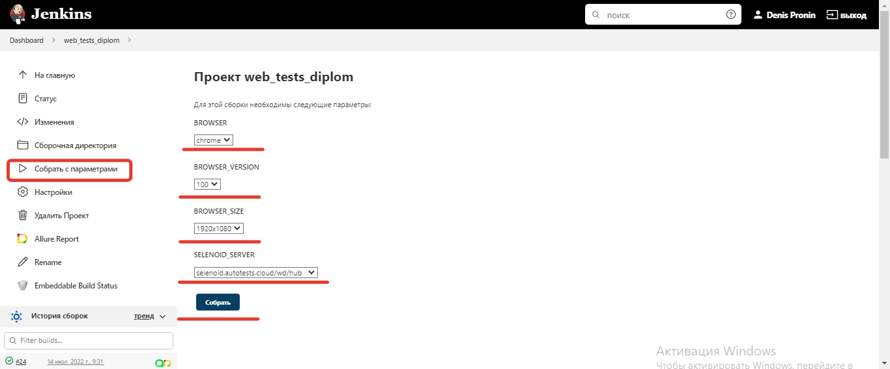
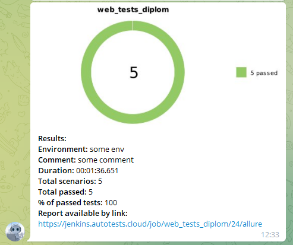

## Тестирование UI сайта компании "Расчетные системы"
#### российский разработчик и интегратор, входит в Группу Т1
> <a target="_blank" href="https://tprs.ru/">Ссылка на главную страницу сайта</a>


###  Содержание:

- [Технологии и инструменты](#techno-технологии-и-инструменты)
- [Реализованные проверки](#control-Реализованные-проверки)
- [Сборка в Jenkins](#jenkins-Jenkins-job)
- [Запуск из терминала](#terminal-Запуск-тестов-из-терминала)
- [Allure отчет](#report-Allure-отчет)
- [Отчет в Telegram](#telegram-Уведомление-в-Telegram-при-помощи-бота)
- [Видео примеры прохождения тестов](#earth_africa-Примеры-видео-о-прохождении-тестов)

<a name="techno-технологии-и-инструменты"></a>
###  Технологический стек

<p align="center">


</p>


<a name="control-Реализованные-проверки"></a>
###  Список проверок, реализованных в автотестах
- [x] Проверка заголовка на главной странице
- [x] Переключение кнопок в шапке сайта
- [x] На вкладке "Проекты" проверка кнопки "Offline"
- [x] Проверка адреса на вкладке "Контакты"
- [x] Проверка появления поп-апа "Напишите нам"

<a name="jenkins-Jenkins-job"></a>
###   Сборка в Jenkins
###  Запуск тестов в [Jenkins](https://jenkins.autotests.cloud/job/Test-vacancy/)
*Для запуска сборки необходимо нажать кнопку <code><strong>*Собрать с параметрами*</strong></code> и указать значения параметров.*

<p align="center">
  
</p>

### Удаленный запуск тестов

```bash
gradle clean test 
-Dbrowser=${BROWSER} 
-DbrowserVersion=${BROWSER_VERSION} 
-DbrowserSize=${BROWSER_SIZE} 
-DselenoidServer=${SELENOID_SERVER}
```

### Параметры сборки

> <code>BROWSER</code> – браузер, в котором будут выполняться тесты.
>
> <code>BROWSER_VERSION</code> – версия браузера, в которой будут выполняться тесты.
>
> <code>BROWSER_SIZE</code> – разрешени окна браузера, в котором будут выполняться тесты.
>
> <code>SELENOID_SERVER</code> – адрес удаленного сервера, на котором будут запускаться тесты.
>

<a name="terminal-Запуск-тестов-из-терминала"></a>
### :terminal: Запуск из терминала
```bash
gradle clean test
```

<a name="report-Allure-отчет"></a>
### :report:  Allure Reports отчет
###  Запуск тестов в [Jenkins](https://jenkins.autotests.cloud/job/Test-vacancy/)
<p align="center">
  
</p>

<p align="center">
  
</p>

<a name="telegram-Уведомление-в-Telegram-при-помощи-бота"></a>
### :telegram: Отчет в Telegram

<p align="center">
  
</p>

<a name="earth_africa-Примеры-видео-о-прохождении-тестов"></a>
### Видео прохождения тестов

> К каждому тесту в отчете прилагается видео.
<p align="center">
  
</p>


:heart: <a target="_blank" href="https://qa.guru">qa.guru</a><br/>
:blue_heart: <a target="_blank" href="https://t.me/qa_automation">t.me/qa_automation</a>